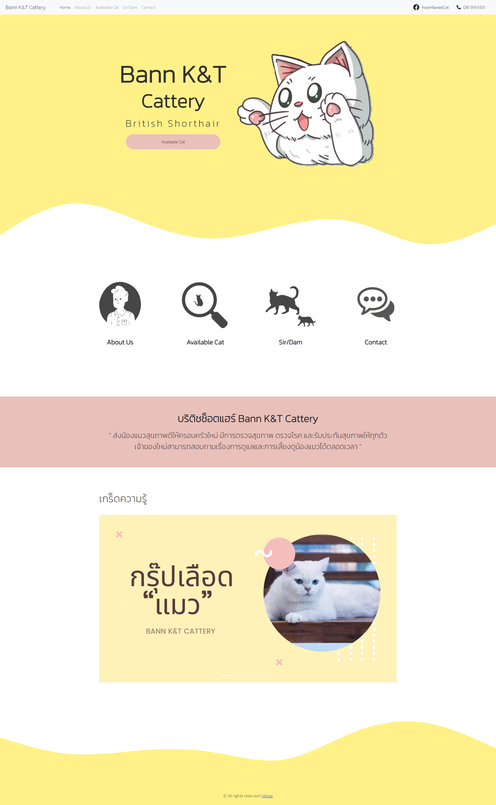
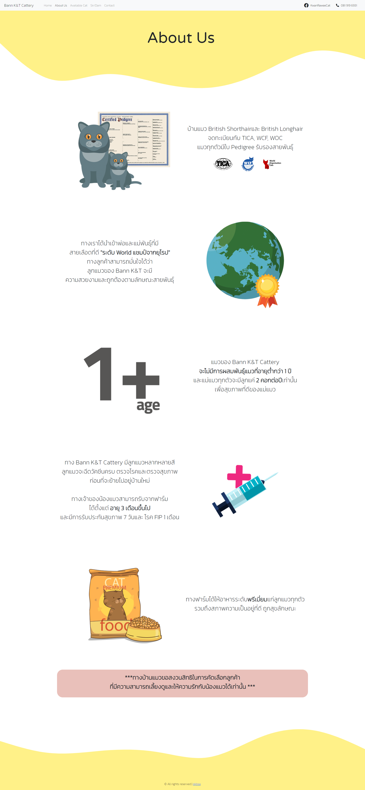
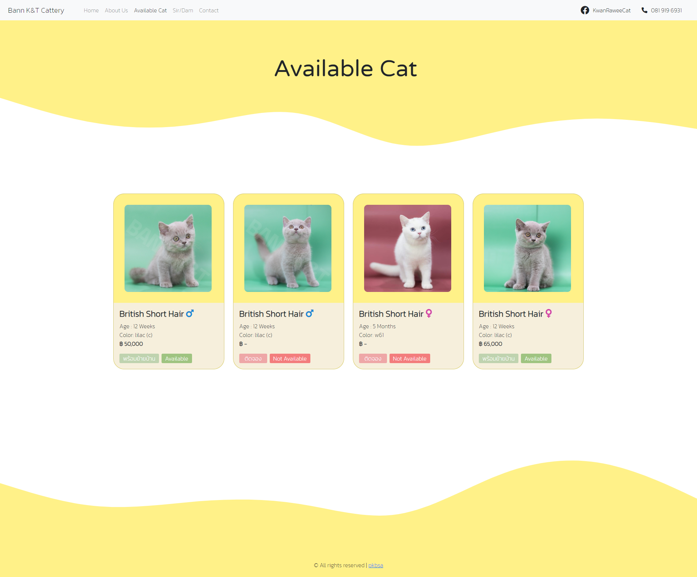
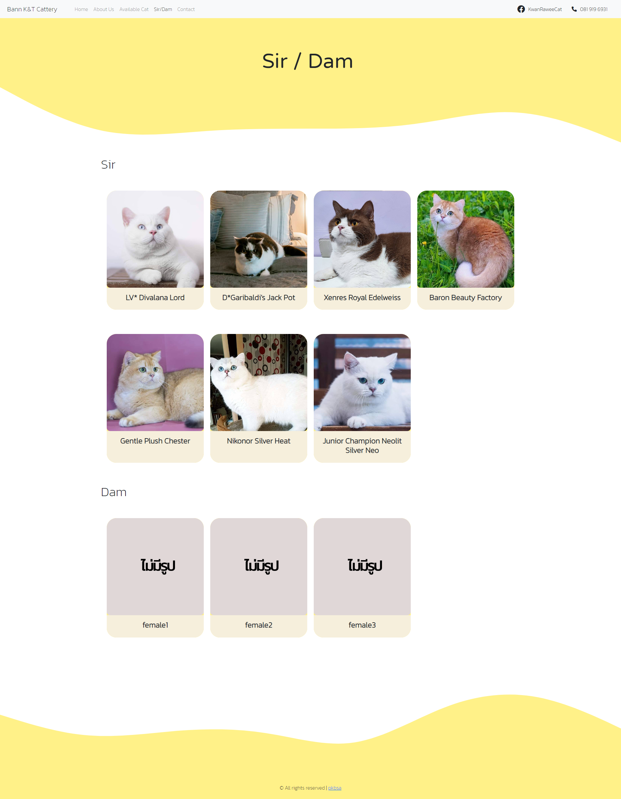
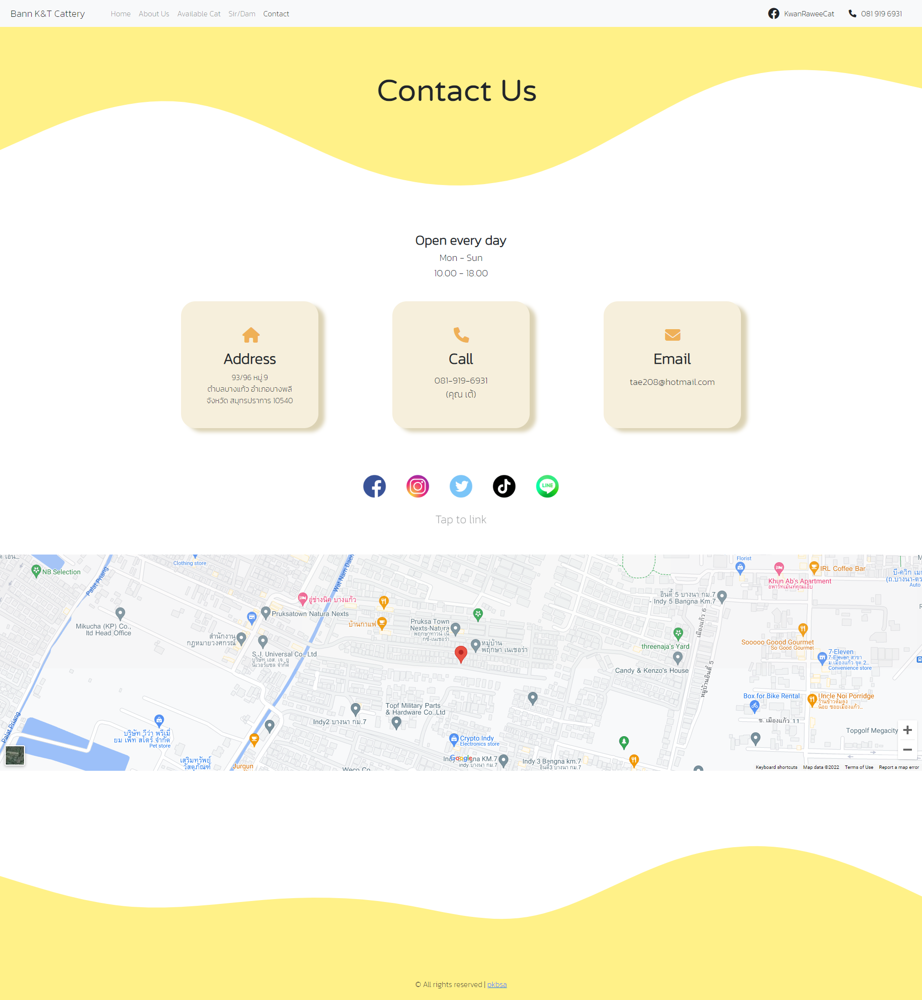
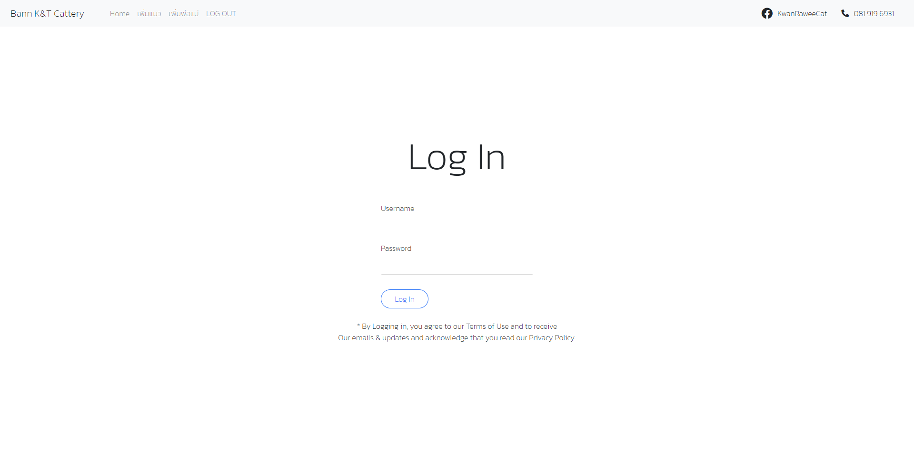
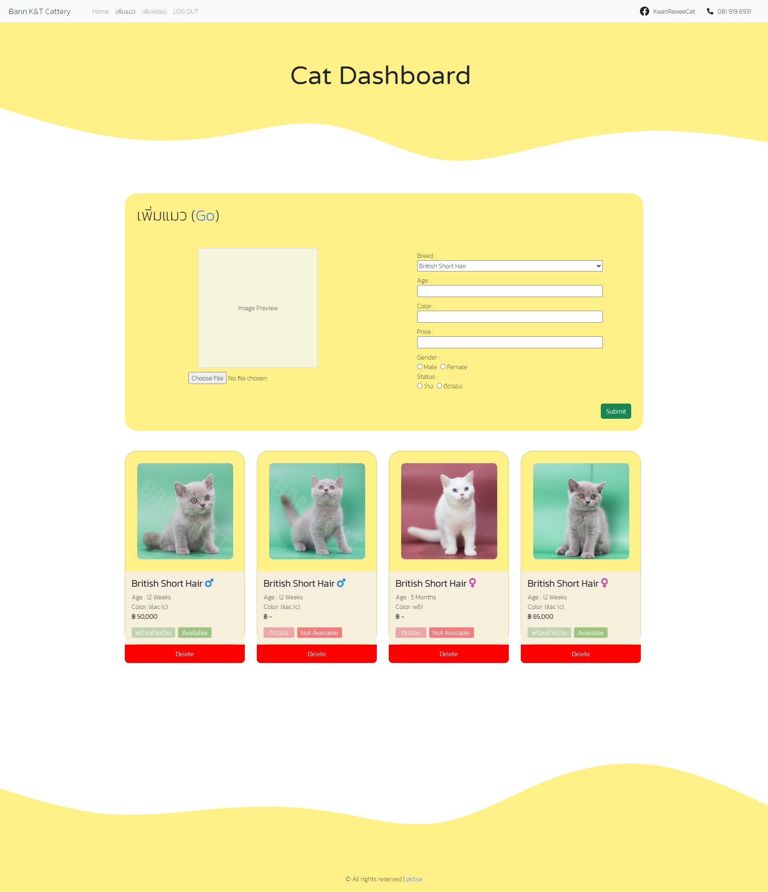
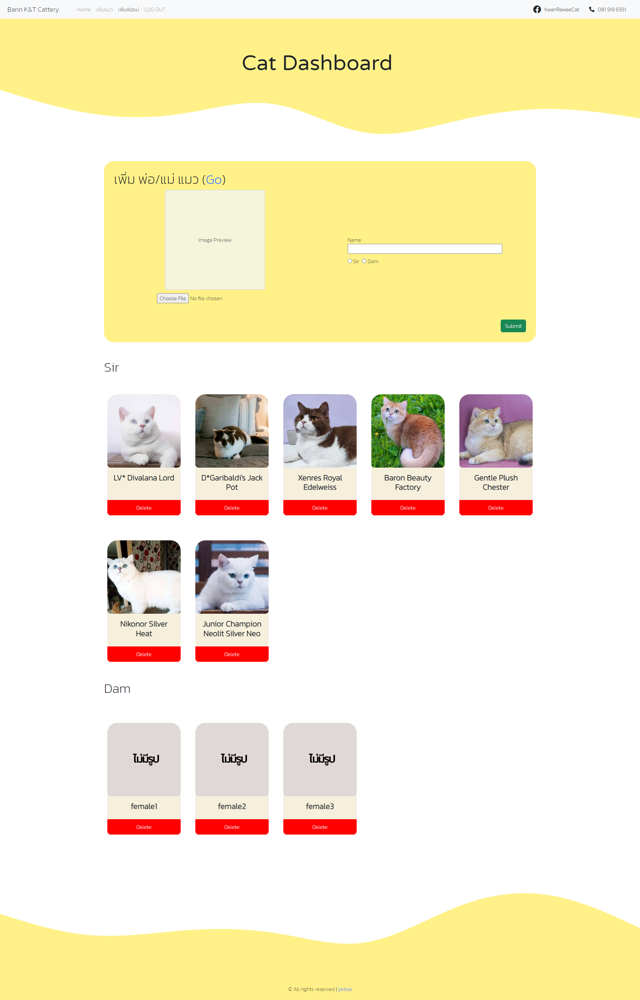
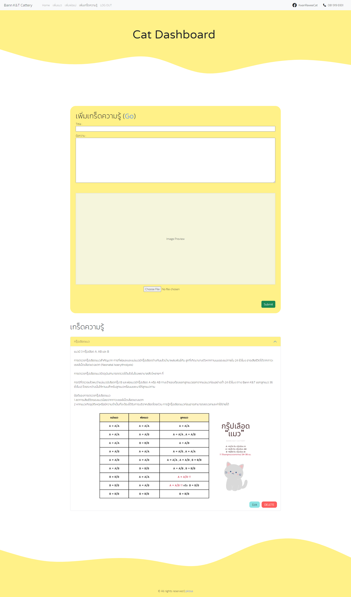

<h1>Cattery Website That I Have Created Recently</h1>

<p>to run this website : </p>

```
     npm i install
     npm start
     
```
<h5>Don't Forget to import the database to match your localhost</h5>

<p>you can enter the website admin panel by clicking at the hyperlink at the footer</p>

<p> Here are how all my page look likes </p>

<h4>Homepage</h4>


<h4>About Us</h4>


<h4>Availble</h4>


<h4>Sir / Dam</h4>


<h4>Contact</h4>


<h4>admin login</h4>


<h4>Admin addcat</h4>


<h4>Admin addparent</h4>


<h4>Admin addtips</h4>
