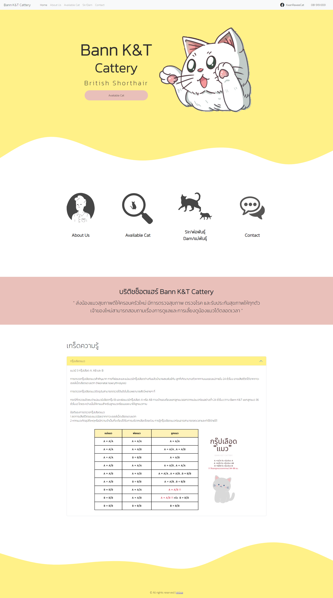

# bann-kt-nodejs
This website is a platform for a cattery business, built using Node.js as the backend and the EJS template engine for rendering views. The website utilizes a SQL relational database to store and retrieve information about the cattery's cats and services. The design of the website is based on the Bootstrap framework, ensuring a responsive and user-f

to run the service you will need to install all of the package include in package.json
```
npm install
```

After install all the package needed, you will need to create new SQL Database, Import the Given SQL Queries and change the credentials of the DB in app.js,
(he current DB does not work anymore since I didn't manage to extend the session of it)
```
var connection = mysql.createConnection({
    host: "localhost",
    user: "Username",
    password: "Password",
    database: "Database Name"
});
```

To run the website type :

```
npm start
```
or 
```
node app.js
```

Snapshot of the website :



